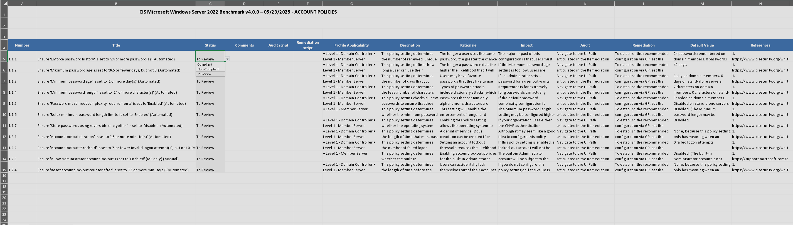
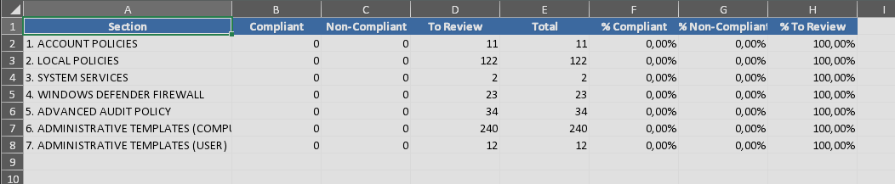

# CIS Benchmark to Excel Converter

> **Fork of:** [Octomany/cisbenchmarkconverter](https://github.com/Octomany/cisbenchmarkconverter)  
> **Modified by:** kernyx64 | **Date:** December 29, 2025

Excel-focused fork for CIS compliance tracking with automated scoring and multi-OS support.

## Key Features

- ✅ **Excel-only output** with professional formatting
- ✅ **Automated SCORE sheet** with compliance percentages
- ✅ **Status dropdown** (Compliant/Non-Compliant/To Review) + conditional formatting
- ✅ **Multi-OS support** via JSON config with auto-detection
- ✅ **One worksheet per section** - organized and easy to navigate
- ✅ **Enhanced filtering** - removes section headers, keeps only real tests

## Screenshots

### Excel Output with Dropdown & Worksheets


### SCORE Sheet with Compliance Tracking


## Supported OS

| OS | Tested | start_page |
|----|--------|------------|
| Debian 13 | ✅ | 23 |
| Debian 12 | ✅ | 23 |
| Windows 11 | ✅ | 61 |
| Windows Server 2022 | ✅ | 38 |
| Ubuntu | ⚠️ Config ready | TBD |

## Installation
```bash
git clone https://github.com/kernyx64/cisbenchmarkconverter.git
cd cisbenchmarkconverter
pip install -r requirements.txt
```

## Usage
```bash
# Basic
python cis_benchmark_converter_final.py -i input.pdf -o output.xlsx --start_page 23

# Examples
python cis_benchmark_converter_final.py -i CIS_Debian_13.pdf -o Debian13.xlsx --start_page 23
python cis_benchmark_converter_final.py -i CIS_Windows_11.pdf -o Win11.xlsx --start_page 61
python cis_benchmark_converter_final.py -i CIS_Windows_Server_2022.pdf -o WinSrv22.xlsx --start_page 38
```

## Output Structure

Each worksheet = one CIS section (e.g., ACCOUNT POLICIES, LOCAL POLICIES, etc.)

**Columns:**
- Number, Title, **Status** (dropdown), Comments, Audit/Remediation scripts
- All CIS fields: Profile, Description, Rationale, Impact, Audit, etc.

**SCORE Sheet:**
- Total recommendations per section
- Compliance counts and percentages
- Conditional formatting: Compliant | Non-Compliant | To Review

## Adding New OS

Edit `cis_categories.json`:
```json
{
  "rhel": {
    "1": "INITIAL SETUP",
    "2": "SERVICES",
    "3": "NETWORK CONFIGURATION"
  }
}
```

Run with `--os-type rhel` or name your PDF `CIS_RHEL_*` for auto-detection.

## What's Different from Original?

| Feature | Original | This Fork |
|---------|----------|-----------|
| Formats | CSV, JSON, Excel | **Excel only** |
| Tracking | No | **Yes - dropdown + scoring** |
| Multi-OS | Hardcoded | **JSON config** |
| Organization | Single sheet | **One sheet per section** |

## Credits

- **Original:** [Octomany](https://github.com/Octomany)
- **Fork:** kernyx64

---

For the original multi-format converter, see [Octomany/cisbenchmarkconverter](https://github.com/Octomany/cisbenchmarkconverter) 
```